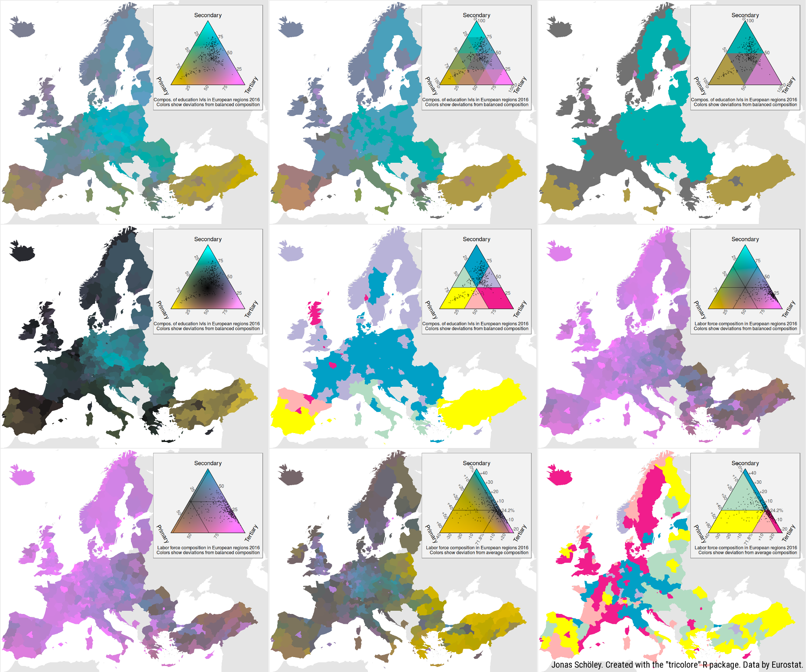
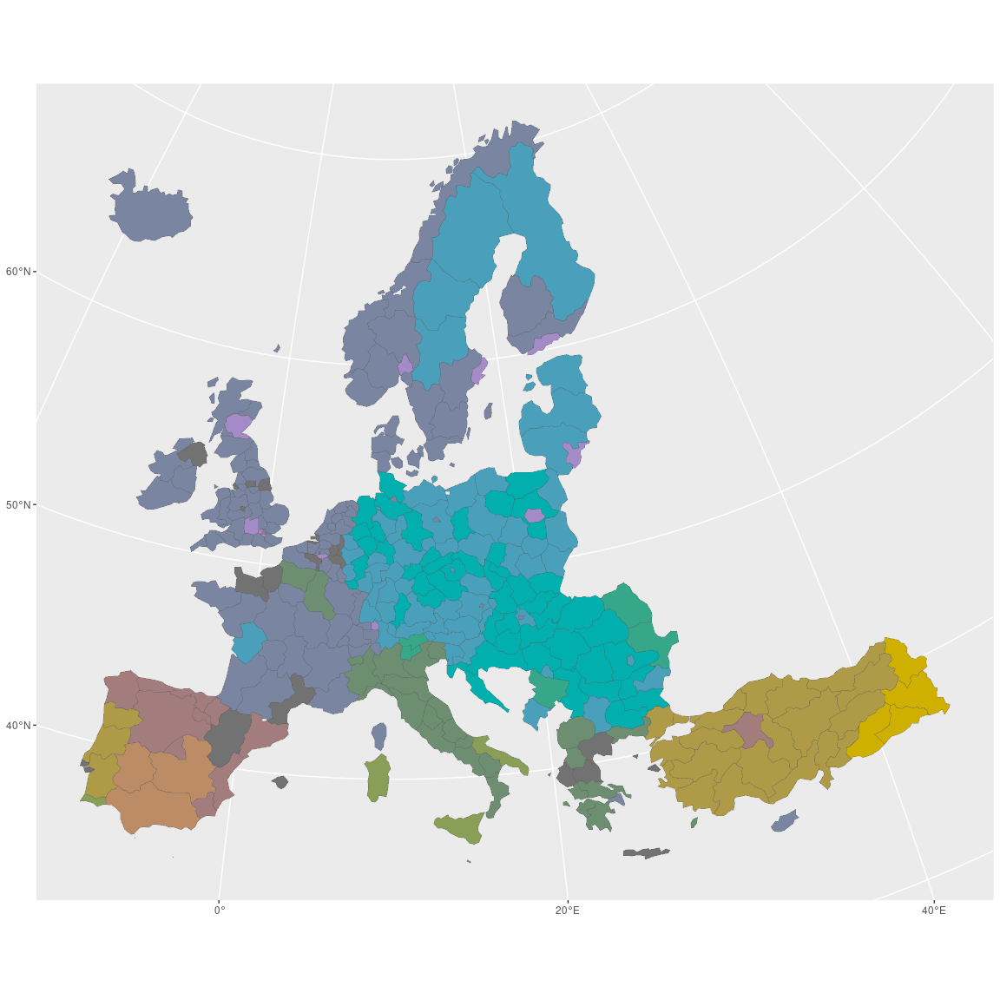
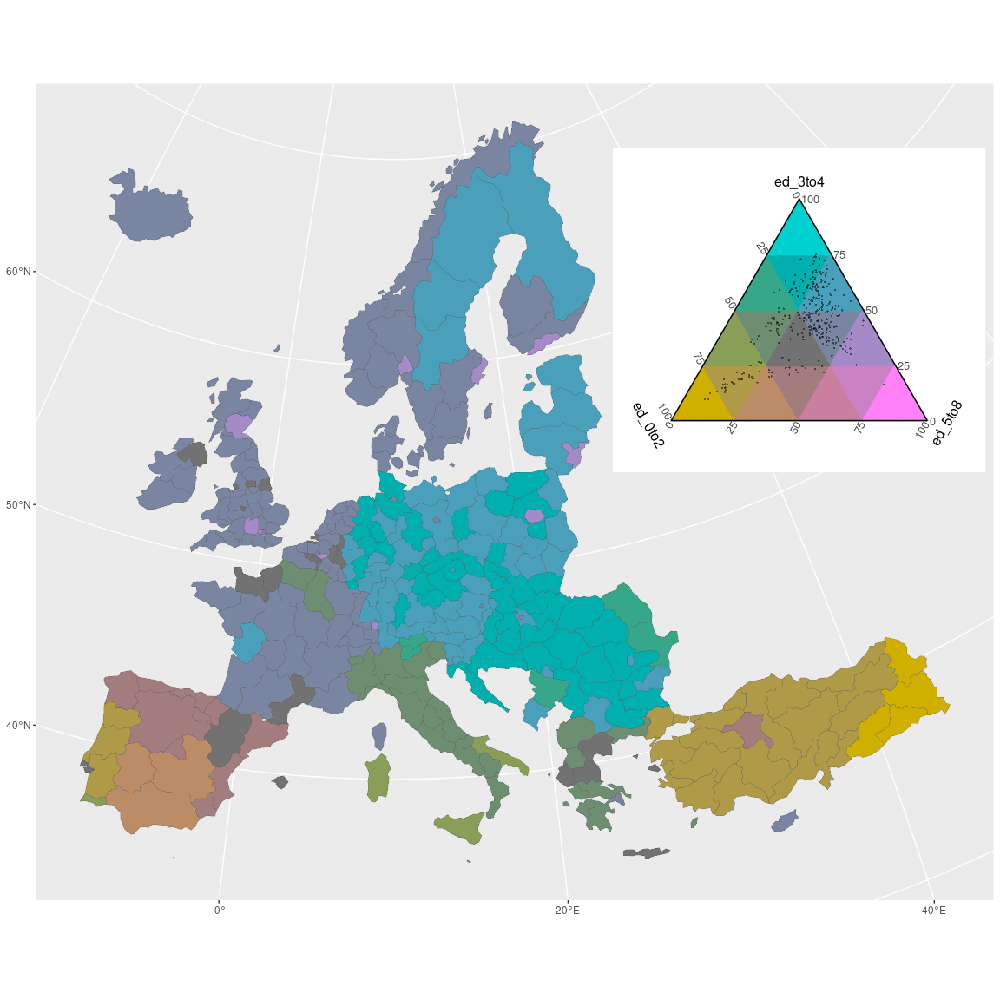
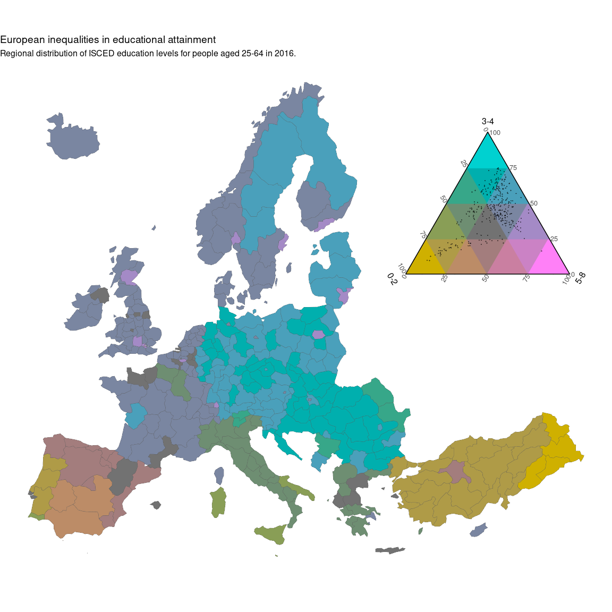
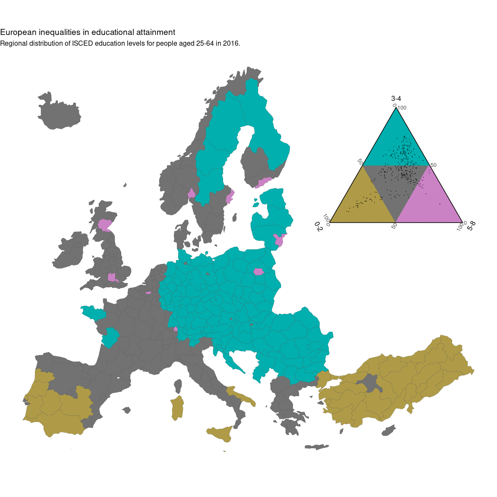
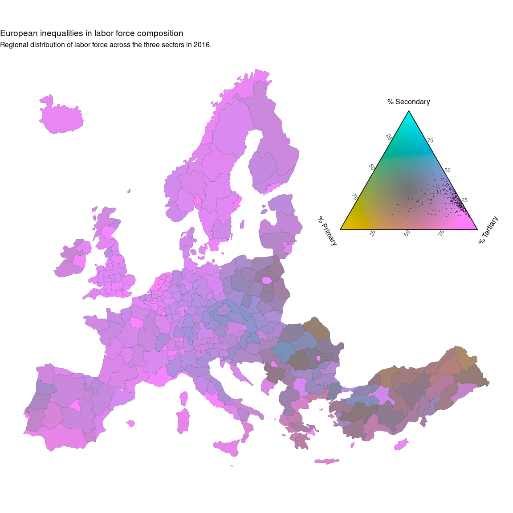
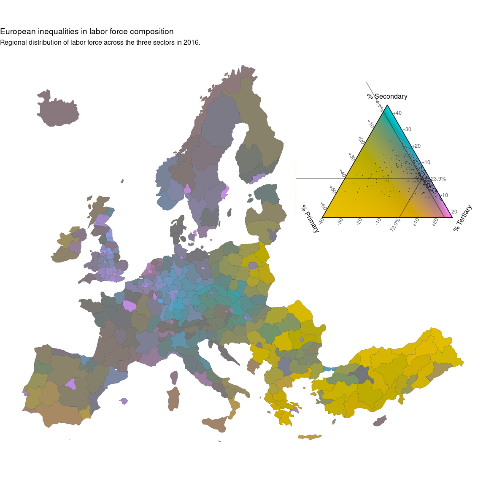

 tricolore. A flexible color scale for ternary compositions
================
Jonas Schöley & Ilya Kashnitsky

[](https://cran.r-project.org/package=tricolore)
[](https://www.gnu.org/licenses/gpl-3.0)

## What is *tricolore*?

`tricolore` is an R library providing a flexible color scale for the
visualization of three-part (ternary) compositions. Its main
functionality is to color-code any ternary composition as a mixture of
three primary colors and to draw a suitable color-key. `tricolore`
flexibly adapts to different visualization challenges via

  - *discrete* and *continuous* color support,
  - support for unbalanced compositional data via *centering*,
  - support for data with very narrow range via *scaling*,
  - *hue*, *chroma* and *lightness* options.



## Getting Started

``` r
install.packages('tricolore')
library(tricolore); DemoTricolore()
```

The `Tricolore()` function expects a dataframe of three-part
compositions, color-codes the compositions and returns a list with
elements `rgb` and `key`. The first list element is a vector of rgb
codes for the color-coded compositions, the latter element gives a plot
of the color key.

Here’s a minimal example using simulated data.

``` r
library(tricolore)

# simulate 243 ternary compositions
P <- as.data.frame(prop.table(matrix(runif(3^6), ncol = 3), 1))
# color-code each composition and return a corresponding color key
colors_and_legend <- Tricolore(P, 'V1', 'V2', 'V3')
# the color-coded compositions
head(colors_and_legend$rgb)
```

    ## [1] "#A37D7D" "#7A86A1" "#AF9B47" "#6E8E72" "#00AFAE" "#727272"

``` r
colors_and_legend$key
```


You can familiarize yourself with the various options of `tricolore` by
running `DemoTricolore()`.

## Ternary choropleth maps

Here I demonstrate how to create a choropleth map of the regional
distribution of education attainment in Europe 2016 using `ggplot2`.

The data set `euro_example` contains the administrative boundaries for
the European NUTS-2 regions in the column `geometry`. This data can be
used to plot a choropleth map of Europe using the `sf` package. Each
region is represented by a single row. The name of a region is given by
the variable `name` while the respective
[NUTS-2](https://en.wikipedia.org/wiki/Nomenclature_of_Territorial_Units_for_Statistics)
geocode is given by the variable `id`. For each region some
compositional statistics are available: Variables starting with `ed`
refer to the relative share of population ages 25 to 64 by educational
attainment in 2016 and variables starting with `lf` refer to the
relative share of workers by labor-force sector in the European NUTS-2
regions 2016.

**1. Using the `Tricolore()` function, color-code each educational
composition in the `euro_example` data set and add the resulting vector
of hex-srgb colors as a new variable to the dataframe. Store the color
key separately.**

``` r
# color-code the data set and generate a color-key
tric_educ <- Tricolore(euro_example,
                       p1 = 'ed_0to2', p2 = 'ed_3to4', p3 = 'ed_5to8')
```

`tric` contains both a vector of color-coded compositions (`tric$rgb`)
and the corresponding color key (`tric$key`). We add the vector of
colors to the map-data.

``` r
# add the vector of colors to the `euro_example` data
euro_example$educ_rgb <- tric_educ$rgb
```

**2. Using `ggplot2` and the joined color-coded education data and
geodata, plot a ternary choropleth map of education attainment in the
European regions. Add the color key to the map.**

The secret ingredient is `scale_fill_identity()` to make sure that each
region is colored according to the value in the `educ_rgb` variable of
`euro_example`.

``` r
library(ggplot2)

plot_educ <-
  # using data sf data `euro_example`...
  ggplot(euro_example) +
  # ...draw a choropleth map
  geom_sf(aes(fill = educ_rgb, geometry = geometry), size = 0.1) +
  # ...and color each region according to the color-code
  # in the variable `educ_rgb`
  scale_fill_identity()

plot_educ
```

<!-- -->

Using `annotation_custom()` and `ggplotGrob` we can add the color key
produced by `Tricolore()` to the map. Internally, the color key is
produced with the [`ggtern`](http://www.ggtern.com/) package. In order
for it to render correctly we need to load `ggtern` *after* loading
`ggplot2`. Don’t worry, the `ggplot2` functions still work.

``` r
library(ggtern)
plot_educ +
  annotation_custom(
    ggplotGrob(tric_educ$key),
    xmin = 55e5, xmax = 75e5, ymin = 8e5, ymax = 80e5
  )
```

<!-- -->

Because the color key behaves just like a `ggplot2` plot we can change
it to our liking.

``` r
plot_educ <-
  plot_educ +
  annotation_custom(
    ggplotGrob(
      tric_educ$key +
        labs(L = '0-2', T = '3-4', R = '5-8')),
    xmin = 55e5, xmax = 75e5, ymin = 8e5, ymax = 80e5
  )
plot_educ
```

<!-- -->

Some final touches…

``` r
plot_educ +
  theme_void() +
  coord_sf(datum = NA) +
  labs(title = 'European inequalities in educational attainment',
       subtitle = 'Regional distribution of ISCED education levels for people aged 25-64 in 2016.')
```

<!-- -->

## Continuous vs. discrete colors

By default `tricolore` uses a discrete colors scale with 16 colors. This
can be changed via the `breaks` parameter. A value of `Inf` gives a
continuous color scale…

``` r
# color-code the data set and generate a color-key
tric_educ_disc <- Tricolore(euro_example,
                            p1 = 'ed_0to2', p2 = 'ed_3to4', p3 = 'ed_5to8',
                            breaks = Inf)
euro_example$educ_rgb_disc <- tric_educ_disc$rgb

ggplot(euro_example) +
  geom_sf(aes(fill = educ_rgb_disc, geometry = geometry), size = 0.1) +
  scale_fill_identity() +
  annotation_custom(
    ggplotGrob(
      tric_educ_disc$key +
        labs(L = '0-2', T = '3-4', R = '5-8')),
    xmin = 55e5, xmax = 75e5, ymin = 8e5, ymax = 80e5
  ) +
  theme_void() +
  coord_sf(datum = NA) +
  labs(title = 'European inequalities in educational attainment',
       subtitle = 'Regional distribution of ISCED education levels for people aged 25-64 in 2016.')
```

<!-- -->

…and a `breaks = 2` gives a discrete color scale with \(2^2=4\) colors,
highlighting the regions with an absolute majority of any part of the
composition.

``` r
# color-code the data set and generate a color-key
tric_educ_disc <- Tricolore(euro_example,
                            p1 = 'ed_0to2', p2 = 'ed_3to4', p3 = 'ed_5to8',
                            breaks = 2)
euro_example$educ_rgb_disc <- tric_educ_disc$rgb

ggplot(euro_example) +
  geom_sf(aes(fill = educ_rgb_disc, geometry = geometry), size = 0.1) +
  scale_fill_identity() +
  annotation_custom(
    ggplotGrob(
      tric_educ_disc$key +
        labs(L = '0-2', T = '3-4', R = '5-8')),
    xmin = 55e5, xmax = 75e5, ymin = 8e5, ymax = 80e5
  ) +
  theme_void() +
  coord_sf(datum = NA) +
  labs(title = 'European inequalities in educational attainment',
       subtitle = 'Regional distribution of ISCED education levels for people aged 25-64 in 2016.')
```

<!-- -->

## Ternary centering

While the ternary balance scheme allows for dense yet clear
visualizations of *well spread out* ternary compositions the technique
is less informative when used with highly *unbalanced data*. The map
below shows the regional labor force composition in Europe as of 2016 in
nearly monochromatic colors, the different shades of blue signifying a
working population which is concentrated in the tertiary (services)
sector. Regions in Turkey and Eastern Europe show a somewhat higher
concentration of workers in the primary (production) sector but overall
the data shows little variation with regards to the *visual reference
point*, i.e. the greypoint marking perfectly balanced proportions.

``` r
tric_lf_non_centered <- Tricolore(euro_example, breaks = Inf,
                                  'lf_pri', 'lf_sec', 'lf_ter')

euro_example$rgb_lf_non_centered <- tric_lf_non_centered$rgb

ggplot(euro_example) +
  geom_sf(aes(fill = rgb_lf_non_centered, geometry = geometry), size = 0.1) +
  scale_fill_identity() +
  annotation_custom(
    ggplotGrob(tric_lf_non_centered$key +
                 labs(L = '% Primary', T = '% Secondary', R = '% Tertiary')),
    xmin = 55e5, xmax = 75e5, ymin = 8e5, ymax = 80e5
  ) +
  theme_void() +
  coord_sf(datum = NA) +
  labs(title = 'European inequalities in labor force composition',
       subtitle = 'Regional distribution of labor force across the three sectors in 2016.')
```

<!-- -->

A remedy for analyzing data which shows little variation in relation to
some reference point is to *change the point of reference*. The map
below yet again shows the European regional labor force composition in
2016 but the color scale has been altered so that its greypoint – the
visual point of reference – is positioned at the European annual
average. Consequently the colors now show direction and magnitude of the
deviation from the European average labor force composition. Pink, Green
and Blue hues show a higher than average share of workers in the
primary, secondary and tertiary sector respectively. The saturation of
the colors show the magnitude of that deviation with perfect grey
marking a region that has a labor force composition equal to the
European average, i.e. the reference point.

Centering the color scale over the labor-force composition of the
average European NUTS-2 region shows various patterns of deviations from
the average. Metropolitan regions (Hamburg, Stockholm, Paris, Madrid)
have a higher than average share of tertiary workers. Large parts of
France are quite grey, indicating a labor-force composition close to the
average, while Eastern Europe, the south of Spain and Italy have a
higher than average share of workers active in the primary sector.

``` r
tric_lf_centered <-
  Tricolore(euro_example,
            'lf_pri', 'lf_sec', 'lf_ter',
            center = NA, crop = TRUE)

euro_example$rgb_lf_centered <- tric_lf_centered$rgb

ggplot(euro_example) +
  geom_sf(aes(fill = rgb_lf_centered, geometry = geometry), size = 0.1) +
  scale_fill_identity() +
  annotation_custom(
    ggplotGrob(
      tric_lf_centered$key +
        labs(L = '% Primary', T = '% Secondary', R = '% Tertiary')),
    xmin = 55e5, xmax = 75e5, ymin = 8e5, ymax = 80e5
  ) +
  theme_void() +
  coord_sf(datum = NA) +
  labs(title = 'European inequalities in labor force composition',
       subtitle = 'Regional distribution of labor force across the three sectors in 2016.')
```

<!-- -->

## Contributing

This software is an academic project. We welcome any issues and pull
requests.

Please report any bugs you find by submitting an issue on
github.com/jschoeley/tricolore/issues.

If you wish to contribute, please submit a pull request following the
guidelines stated in
[CONTRIBUTING.md](https://github.com/jschoeley/tricolore/blob/devel/CONTRIBUTING.md).
